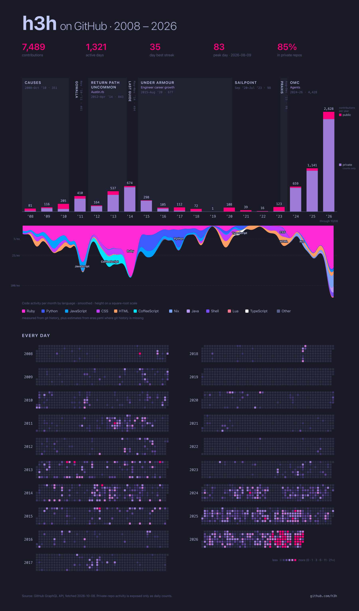

# github-contribs-poster

An all-time GitHub contributions poster: contributions per year (public vs private) with career eras shaded behind the bars, plus every day since 2008 as a heatmap.



Interactive version: https://h3h.github.io/github-contribs-poster/

## Usage

```sh
python3 -m venv .venv && .venv/bin/pip install -r requirements.txt   # PyYAML, for eras.yaml
./fetch_data.py [login]   # needs an authenticated `gh`; writes data/contributions.json
./fetch_languages.py --author "Your Name" --local ~/work/*   # optional; writes data/languages.json
./render.sh               # writes output/*.svg, output/*.html, and, with rsvg-convert, output/*.png
```

- `.venv/bin/python3 make_poster.py solarized` renders a single theme (`tokyonight` is the default).
- `.venv/bin/python3 make_page.py [theme]` builds a self-contained interactive page: hover a year, era, language band, legend entry, or day for its numbers.
- Career eras live in [`eras.yaml`](eras.yaml): a title, an optional subtitle, and start/end dates as `YYYY`, `YYYY-MM`, or `YYYY-MM-DD`. Replace them with your own, or delete them for a poster with no eras. `--eras path/to/file.yaml` points at a different file.
- The language chart under the bars comes from `fetch_languages.py`. It reads git history: every repo GitHub lists your commits in (cloned into `.cache/`), plus any `--local` clones of private work. Each commit counts once, split by lines changed per language in code files. `--author` takes git author patterns; pass every name and email you've committed under. Only monthly totals per language are saved.
- Months that git history can't fully explain get filled from an era's `languages` mix in `eras.yaml`, in the same band as the measured commits.
- No `rsvg-convert`? Run `nix shell nixpkgs#librsvg -c ./render.sh`.

## Data caveats

- GitHub reports private-repo activity only as counts: daily totals in the calendar plus a per-year private total. Repo, language, and contribution type exist only for the public slice.
- Contributions to private org repos appear only if "Include private contributions on my profile" is enabled.
